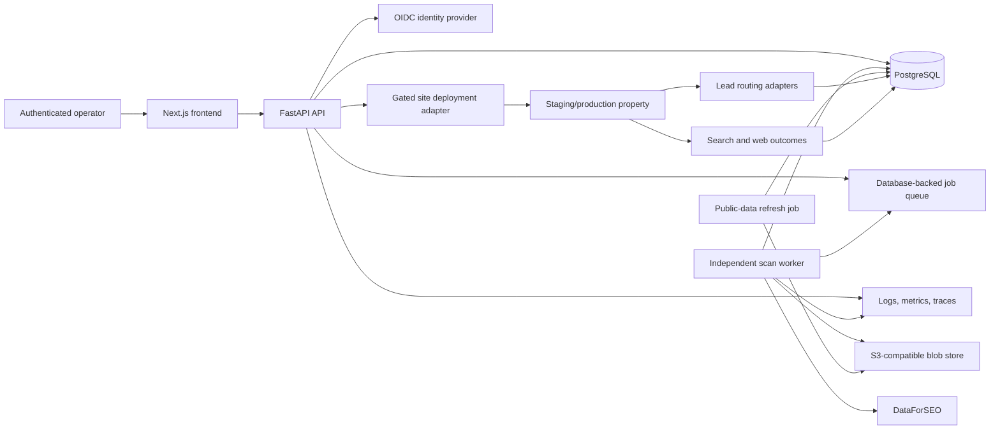

# Production Architecture

This is the implemented target architecture and the local Compose topology. Local Compose
currently runs PostgreSQL, a one-shot migration, a separate API, a separate worker, and the
Next.js frontend. Managed OIDC, Redis, object storage, telemetry export, and public deployment
remain unprovisioned production dependencies.

## Target Topology

## Boundaries

- The frontend never receives provider or infrastructure secrets.
- The API authenticates operators, validates roles, records audit events, and creates
  plans; it does not perform paid scan work inline.
- The worker leases jobs, reserves planned calls, enforces budgets and qualification,
  stores immutable raw responses, and writes normalized evidence.
- PostgreSQL stores transactional state and blob lineage. Large immutable payloads live
  in object storage.
- Public-data assessment remains separate from SEO scoring.
- Property deployment is blocked until review, compliance, domain, routing, and release
  gates pass.
- Provider replacement changes assignment configuration while preserving the property,
  public number, domain, content history, and analytics lineage.

## Versioned Decisions

Every scan records scoring, evidence-quality, service-catalog, classification, geography,
prefilter, adapter, normalization, and cost-control versions. Every deployment records
its site template, SiteConfig, provider assignment, compliance review, build, image, and
release versions.
